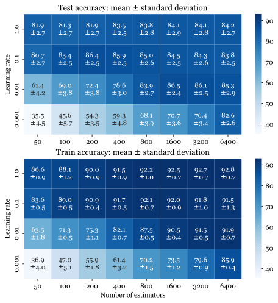

# Advanced-ML-miniProject

## Repository structure

- **`documents/`**: Contains our final report for the project, and the paper that introduced the SSVEP dataset.
- **`src/`**: Contains the main source code of the project. As the only deliverable for this project was the report, the code is organized in python scripts with code cells (to be executed with environments that support cell-based execution, such as VS Code and Spyder). The focus here was not to write clean and maintainable code, but to quickly get results.
- **`plots/`**: Contains all the plots that were generated and eventually included in the final report.
- `.gitignore`: lists the `selected_channels.npy` file, which is the dataset we used to run the code - as it weighs too much.

## Overview

The goal of this project is to thoroughly compare two classifiers: the Gaussian Process classifier (GPC) and AdaBoost.
We do so using a steady state visually evoked potentials (SSVEP) dataset.

### The classifiers

**AdaBoost**, short for Adaptive Boosting, is a statistical classification meta-algorithm that combines ”weak learners” (such as decision stumps) by training them in a smart way: each learner complements the previous ones by focusing more on misclassified
samples. AdaBoost was the first ”boosting” algorithm, an approach to machine learning that has seen a tremendous amount of success. Tens of variants have been proposed in the last two decades, in order to reduce overfitting, increase robustness to noise or tailor it to specific problems. Here we will focus on the popular Real AdaBoost, which typically converges faster than the original algorithm, achieving a lower test error with fewer boosting iterations.

The **Gaussian Process Classifier** (GPC) is a non-parametric supervised machine-learning algorithm designed to solve classification problems. It is a Gaussian process (GP), hence a probability distribution over possible functions that fit the training data. The probabilistic characteristics is highly used within Gaussian Processes to give an uncertainty in predictions, nevertheless it will not be considered in this project. The main hyperparameter of the Gaussian process classifier is the choice of the Gaussian kernel that determines almost all the generalization properties of the GP model. The parameters of the model are often auto-tuned during model fitting, and estimated via maximum marginal likelihood, which is a huge advantage of GP as it makes it robust to the initial values of hyperparameters in a kernel. Here we will consider various kernels, and select the one that is optimal for the classification of our dataset.

### The dataset
SSVEPs are neural signals that are natural responses to visual stimulation at specific frequencies. When the retina is excited by a visual stimulus ranging from 3.5 Hz to 75 Hz, the brain generates electrical activity at the same (or multiples of) frequency of the visual stimulus. In 2017, Wang et al. presented a benchmark SSVEP dataset acquired with a 40- target Brain-Computer Interface (BCI) speller. The dataset consists of 64-channel Electroencephalogram (EEG) data from 35 healthy subjects while they performed a cue-guided target selecting task. There are 40 stimulation frequencies ranging from 8 Hz to 15.8 Hz with an interval of 0.2 Hz. The stimulation duration in each trial was five seconds.

## Final grade: 5.75/6

## Plot example
Results of the grid search that we performed on the number of estimators and learning rate for the Real AdaBoost Algorithm, where each estimator is a 1-level decision tree.

